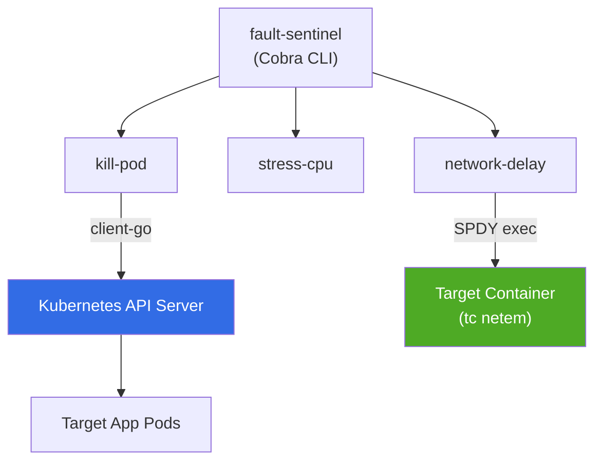

# fault-sentinel

`fault-sentinel` is a lightweight, Kubernetes-native chaos engineering CLI written in Go. It enables platform engineers and developers to inject controlled faults into Kubernetes clusters — including pod termination, CPU stress, and network latency — while exposing real-time experiment telemetry via Prometheus.

---

## Features

- **Pod Termination (`kill-pod`):** Interacts with the Kubernetes API to target pods by label selector and execute controlled deletions, validating cluster self-healing.
- **Network Latency Injection (`network-delay`):** Leverages Linux Traffic Control (`tc netem`) inside target container network namespaces to inject temporary latency with automatic cleanup.
- **CPU Load Generation (`stress-cpu`):** Simulates CPU saturation across configurable cores and durations.
- **Prometheus Observability Exporter:** Ships real-time metrics (counters and duration histograms) on an HTTP endpoint (`:8080/metrics`).
- **Dual Kubeconfig Resolution:** Automatically switches between local `~/.kube/config` and in-cluster ServiceAccount authentication.

---

## System Architecture



---

## Security Model & Trade-offs

- **RBAC Scoping:** Running `kill-pod` requires RBAC permissions to list and delete pods in target namespaces.
- **Linux Capabilities:** Executing `network-delay` relies on `tc` (iproute2) inside the target container and requires the `NET_ADMIN` capability enabled in the pod's `securityContext`.
- **Execution Boundary:** fault-sentinel uses standard `client-go` and SPDY exec connections, eliminating the need to run persistent node-level daemons or agents for basic chaos validation.

---

## Installation & Setup

### Prerequisites

- Go 1.22+
- Docker
- kubectl
- Local cluster: Kind or Minikube (for local development)

### Build from Source

```bash
git clone https://github.com/aashiruu/fault-sentinel.git
cd fault-sentinel

# Download dependencies and build binary
make build
```

The compiled binary will be available at `./bin/fault-cli`.

---

## Usage Guide

### 1. Pod Termination (`kill-pod`)

Randomly selects and deletes a pod matching the specified label selector.

```bash
./bin/fault-cli kill-pod \
  --namespace default \
  --selector app=payment-api \
  --grace-period 30
```

### 2. Network Latency Injection (`network-delay`)

Injects artificial latency into a target container network interface for a set duration before restoring normal network rules.

```bash
./bin/fault-cli network-delay \
  --namespace default \
  --pod payment-api-667fdccc65-gwmfl \
  --container web \
  --delay 250ms \
  --duration 15s
```

### 3. CPU Stress (`stress-cpu`)

Generates local CPU load to evaluate workload performance under compute starvation.

```bash
./bin/fault-cli stress-cpu \
  --cores 2 \
  --duration 30s
```

---

## Telemetry & Metrics

fault-sentinel exposes an HTTP server (default port `:8080`) serving standard Prometheus metrics during experiment execution.

### Exposed Metrics

| Metric Name | Type | Description | Labels |
|---|---|---|---|
| `chaos_experiments_total` | Counter | Total count of executed chaos experiments | `experiment_type`, `status` |
| `chaos_injected_faults_total` | Counter | Total number of injected faults per target | `fault_type`, `target_pod` |
| `chaos_experiment_duration_seconds` | Histogram | Duration of experiments in seconds | `experiment_type` |

### Scraping Metrics

Scrape metrics in a separate terminal while an experiment is active:

```bash
curl -s http://localhost:8080/metrics | grep chaos_
```

Example output:

```
# HELP chaos_injected_faults_total Total number of injected faults per target pod.
# TYPE chaos_injected_faults_total counter
chaos_injected_faults_total{fault_type="network_delay",target_pod="payment-api-667fdccc65-gwmfl"} 1
```

---

## Development & Testing

### Running Tests

Execute the unit test suite with the Go race detector enabled:

```bash
make test
```

### Running Linter

```bash
make lint
```

### Building Container Image

```bash
make docker-build
```

---

## CI/CD Pipeline

This repository uses GitHub Actions (`.github/workflows/ci.yml`) to enforce code quality and security on every push:

- **Linting:** Code style validation via `golangci-lint`.
- **Testing:** Unit test execution with thread-safety race detection (`go test -race`).
- **Container Build:** Multi-stage image assembly using `alpine:3.20`.
- **Vulnerability Scanning:** Automated container scanning via Trivy.
